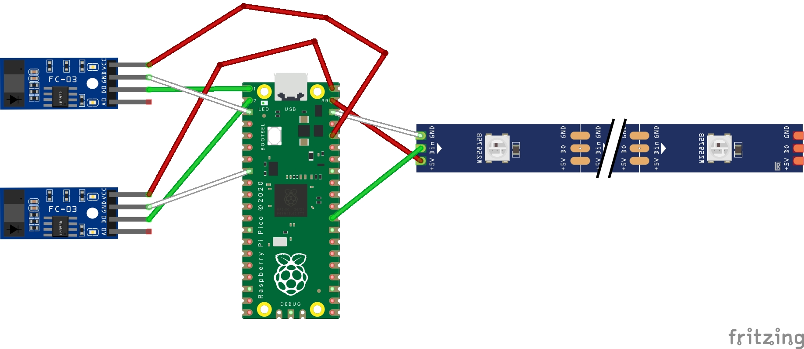
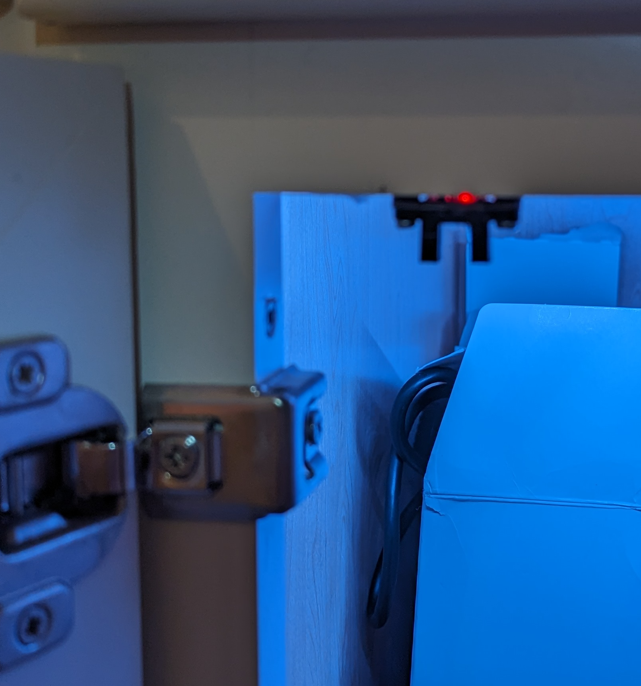
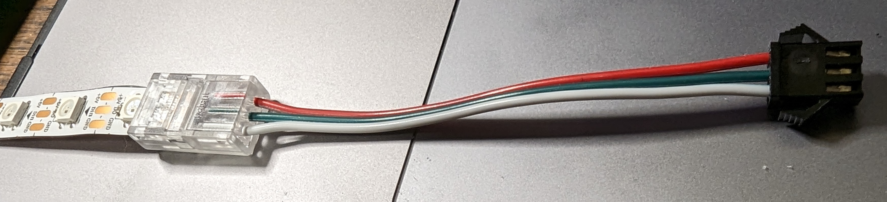

## Overview

This is a Raspberry Pi Pico project to turn on/off a strip of LEDs in a cabinet. The cabinet has double
doors. If either door is opened, the LED strip is turned on. When both doors are closed, the
LED strip is turned off. Opro-couplers are used to detect when the doors are open or closed.

## Technical Details
Even though this is programmatically very simple, I'm going to the trouble of writing this because 
as far as I know, there are few documented examples of opto-couplers for the Pico. 

### Opto-Couplers

Someone suggested I try [opto-couplers](https://en.wikipedia.org/wiki/Opto-isolator) instead of [reed switches](https://en.wikipedia.org/wiki/Reed_switch)
to sense when a door is open. That sounded like a good idea, so this project uses them exclusively. [Here](https://www.amazon.com/dp/B08977QFK5?psc=1&ref=ppx_yo2ov_dt_b_product_details)
is the particular one I'm using.

### State Detection
Since there are 2 doors on the cabinet, there are 2 opto-couplers to detect their individual status. Each 
opto-coupler is mounted on the door frame in the upper left and right respectively (see pics below). On 
each door is a small plastic wedge which fits in the opto-coupler's slot. When the door is closed, the
wedge interrupts the beam sent from one arm of the slot to the other. Conversely, when the door is open,
the wedge is pulled away and the beam is uninterrupted. Sensing the couplers are unblocked, the LED strip
is then illuminated.

## Hardware Notes
the Pico assembly is housed in a small project box. The Pico itself sits on a breakout board. (Why a breakout
board? Because it makes it easy to switch out the Pico if you need to. By using a breakout board, you can just
remove and replace the Pico instead of uninstalling the whole thing) Tiny nylon screws and bolts to secure the
breakout board to the project box.

There are 3 sets of wires on the Pico: one for the LED strip and two for the opto-couplers. THe LED strip
connection uses a BTF male adapter (to match the LED strip's female connector). Both of the two opto-coupler
connections terminate in a BTF female connector (to match the coupler's male connection). See pictures below.

On the back of the project box are strips of magnetic tape. There are also strips of magnetic tape on the wall
of the cupboard. Contact between these two sets of strips is what secures the project box in place on the wall.

### A Hack
I spent a lot of time looking for something to be used for a wedge to interrupt the signal between the two arms of
the slotted optical coupler. It needed to be something unobtrusive but sturdy and could be mounted on the cupboard
door. After paddling far up the Amazon, I finally found what I was looking for.  [These](https://a.co/d/6UiyFLb) are
sliding door floor guides. They are exactly the sturdiness and size I was looking for. Mounted on the cupboard door,
they worked out perfectly - well, almost perfectly. I'll cover that part below.

## LED Strip

The LED strip is a ws2812b strip mounted on the inside of the cupboard. There are 2 things worth mentioning
about it. One, I used a strip-to-wire connector (see pic below) to avoid soldering on the strip. Secondly,
I used double-sided tape to mount the strip (pic below). On the strip is a female BTF connector.

## Lessons Learned
Opto-couplers are a mixed blessing. On the one hand, they are simpler then a reed switch to program. With reed
switches, you have to contend with Normally Open/Normally Closed logic that can be confusing (not to mention the
one [case](https://github.com/gamename/raspberry-pi-pico-w-mailbox-sensor#fun-with-reedish-switches)
I experienced where the vendor got it backwards). With opto-couplers that goes away. there are only two states: open
and closed.

However, reed switches are simpler to set up mechanically.  You just make sure the switch is in proximity to a magnet,
and you're set.  Opto-couplers, or at least the version I'm using, require a more precise approach.  There is a beam
between the 2 arms of the coupler and something has to break that beam in order to establish a state change. Cobbling
that together takes some ingenuity. I experimented with several physical configurations before I found one I liked.
Hence, the opto switch is physically more of a challenge.

## Gotchas 
There was one interesting gotcha. Everything seemed to be working after the initial installation.  The LEDs came on as
expected when I opened the doors. But the LEDs would NOT turn off when both doors were closed. "Ok", I thought, "the
beams are not interrupted by the wedges I had screwed to the doors. Alignment problem of some kind, no doubt."

But after re-re-re-checking alignment, it was clear they were exactly where they should be: positioned between the
beam emitter and receiver when the door was closed.

After much experimentation, I figured out the *color* of the wedge was key. In my case, the wedge was light colored
plastic. When I tried putting a white sheet of paper in the slot (between transmitter and receiver) I got the same
result. The coupler didn't consider itself "blocked". I then tried a dark sheet of paper and got a successful result.  
Therefore, the coupler would only consider itself blocked if something dark was used to block the light beam.

On a hunch, I wrapped black electrical tape around the wedges (see pics below) and it worked! The coupler finally
considered itself blocked with the doors closed. The LEDs dutifully turned off.

Bottom line: Whatever blocks the beam on the coupler needs to be dark. Odd. 

### Wiring
No self-respecting Pico project would be complete without a Fritzing diagram. Here's mine.

## Parts List

[raspberry pi Pico](https://www.amazon.com/dp/B08W3SH4TD?ref=ppx_yo2ov_dt_b_product_details&th=1) 
[Pico breakout board](https://www.amazon.com/gp/product/B0BGHQXSRR/ref=ppx_yo_dt_b_search_asin_title?ie=UTF8&th=1) 
[optocouplers](https://www.amazon.com/gp/product/B08977QFK5/ref=ppx_yo_dt_b_search_asin_title?ie=UTF8&psc=1) 
[project box](https://www.amazon.com/gp/product/B07Q14K8YT/ref=ppx_yo_dt_b_search_asin_title?ie=UTF8&th=1) 
[magnetic tape](https://www.amazon.com/gp/product/B081CZ7V1V/ref=ppx_yo_dt_b_search_asin_title?ie=UTF8&psc=1) 
[double-sided tape](https://www.amazon.com/Double-Mounting-Strong-Adhesive-Waterproof/dp/B09G64BRVY/ref=sr_1_4_sspa?crid=PLX7TF5I8AOO&keywords=double%2Bsided%2Btape&qid=1697418287&sprefix=double%2Bsided%2Btape%2Caps%2C132&sr=8-4-spons&sp_csd=d2lkZ2V0TmFtZT1zcF9hdGY&th=1) 
[sliding door guides](https://www.amazon.com/gp/product/B000I1ASNK/ref=ppx_yo_dt_b_search_asin_title?ie=UTF8&psc=1) (hacked to create the wedges) 
[black electrical tape](https://www.amazon.com/gp/product/B07ZWC2VLX/ref=ppx_yo_dt_b_search_asin_title?ie=UTF8&psc=1) 
[wire](https://www.amazon.com/gp/product/B0BN7CYVLK/ref=ppx_yo_dt_b_search_asin_title?ie=UTF8&th=1) 
[wire connectors](https://www.amazon.com/gp/product/B09PB5TXXG/ref=ppx_yo_dt_b_search_asin_title?ie=UTF8&th=1) 
[USB power supply](https://www.amazon.com/gp/product/B09PB5TXXG/ref=ppx_yo_dt_b_search_asin_title?ie=UTF8&th=1) 
[USB power cable](https://www.amazon.com/gp/product/B07TKHLZHT/ref=ppx_yo_dt_b_search_asin_title?ie=UTF8&psc=1) 
[wood screws](https://www.amazon.com/gp/product/B09VH16TXD/ref=ppx_yo_dt_b_search_asin_title?ie=UTF8&psc=1) 
[drill](https://www.amazon.com/gp/product/B006V6YAPI/ref=ppx_yo_dt_b_search_asin_title?ie=UTF8&psc=1) 
Phillips head screwdriver drill bit (comes with drill) 
[3/32" drill bit](https://www.amazon.com/gp/product/B004GIO0F8/ref=ppx_yo_dt_b_search_asin_title?ie=UTF8&psc=1) 
[nylon screws and bolts](https://www.amazon.com/gp/product/B0744MMJ9V/ref=ppx_yo_dt_b_search_asin_title?ie=UTF8&psc=1) 
[wire cutters](https://www.amazon.com/gp/product/B087P191LP/ref=ppx_yo_dt_b_search_asin_title?ie=UTF8&th=1) 
B[TF Lighting 3-Pin Connectors (1 Male/3 Female)](https://www.amazon.com/gp/product/B01DC0KIT2/ref=ppx_yo_dt_b_search_asin_title?ie=UTF8&th=1) 
[BTF Lighting WS2812B LED Strip](https://www.amazon.com/gp/product/B01CDTEID0/ref=ppx_yo_dt_b_search_asin_title?ie=UTF8&psc=1) 
[LED Strip Couplers (1)](https://www.amazon.com/gp/product/B09KBXT7D4/ref=ppx_yo_dt_b_search_asin_title?ie=UTF8&psc=1) 
[headlamp](https://www.amazon.com/Foxelli-Headlamp-Flashlight-Lightweight-Waterproof/dp/B014JUMTXM/ref=sr_1_1_sspa?crid=132BLWIWJKDMC&keywords=headlamp&qid=1697418825&sprefix=headlamp%2Caps%2C138&sr=8-1-spons&sp_csd=d2lkZ2V0TmFtZT1zcF9hdGY&th=1) (optional - comes in handy under a sink or in a cupboard) 

## Pictures

*Project box with all connections*

*Another view of project box with lid on*

*The back of the project box with magnetic strips*

*View of the opto-coupler mounted inside on cupboard door frame*

*View of the "wedge" mounted on the cupboard door*

*The wedge after being covered with electrical tape*

*The wire-to-strip solder-less connector*

*The connector with wire and ws2812b strip*

*Closeup of LED strip with double-sided tape on back*

*Closeup of opto-coupler mounted inside door frame*

*View of coupler, project box, and LED strip all connected*

